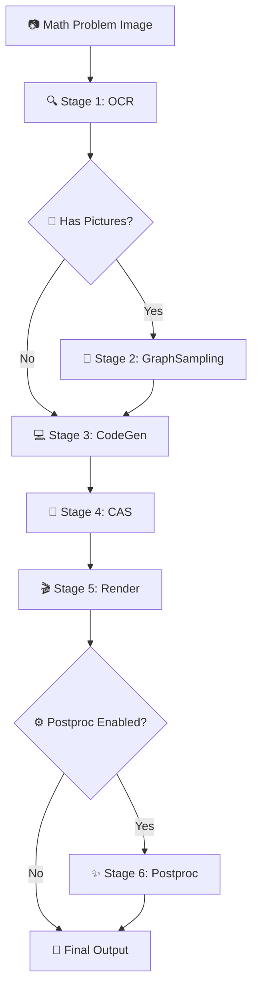

# Manion - AI-Powered Mathematical Animation Pipeline

> Transform mathematical problems into beautiful Manim animations with AI

[](https://python.org)
[](https://manim.community)
[](LICENSE)

## 🌟 Overview

**Manion** is an intelligent pipeline that converts mathematical problem images into high-quality Manim animation code and videos. It combines OCR, graph sampling, code generation, symbolic computation, and post-processing to create educational animations automatically.

### ✨ Key Features

- **🧠 AI-Powered**: Uses advanced OCR and LLM models for accurate mathematical content understanding
- **🎨 Beautiful Animations**: Generates professional-quality Manim animations
- **🔧 Modular Design**: Each stage can be run independently or as part of the full pipeline
- **⚡ Flexible**: Supports both image-only and structured input modes
- **🛡️ Robust**: Comprehensive error handling and safe fallbacks
- **🎯 Smart**: Automatically detects and processes different mathematical content types

## 🚀 Quick Start

### Prerequisites

- Python 3.8 or higher
- CUDA-compatible GPU (recommended for OCR models)

### Installation

1. **Clone the repository**
```bash
git clone <repository-url>
cd manion-main
```

2. **Install dependencies**
```bash
pip install -r requirements.txt
```

3. **Configure your settings**
```bash
# Edit configs/openai.toml to set your API keys and model preferences
cp configs/openai.toml.example configs/openai.toml
```

### Basic Usage

**Run the complete pipeline:**
```bash
# Simple image input
python -m pipelines.cli_e2e path/to/math_problem.png

# With custom problem name
python -m pipelines.cli_e2e path/to/math_problem.png --problem-name "problem1"

# Enable post-processing for enhanced quality
python -m pipelines.cli_e2e path/to/math_problem.png --postproc
```

## 📊 Pipeline Architecture

Manion processes mathematical problems through **6 intelligent stages**:



### Stage Details

| Stage | Name | Purpose | Key Technologies |
|-------|------|---------|------------------|
| 1 | **OCR** | Extract text and mathematical expressions | DotsOCR, Vision Models |
| 2 | **GraphSampling** | Vectorize graphical elements | potrace, SVG processing |
| 3 | **CodeGen** | Generate Manim animation code | GPT, Structured prompts |
| 4 | **CAS** | Perform symbolic computations | SymPy, Dependency resolution |
| 5 | **Render** | Create final Manim code | Placeholder substitution |
| 6 | **Postproc** | Enhance and validate output | LLM refinement, Manim rendering |

## 🛠️ Advanced Usage

### Individual Stage Execution

Run specific pipeline stages independently:

```bash
# Stage 1: OCR Processing
python -m pipelines.cli_stage 1 --image-path problem.png --problem-name "test"

# Stage 2: Graph Sampling (if pictures detected)
python -m pipelines.cli_stage 2 --problem-dir "./temp_ocr_output/test/test"

# Stage 3: Code Generation
python -m pipelines.cli_stage 3 \
  --outputschema-path "outputschema.json" \
  --image-paths "image.jpg" \
  --output-dir "."

# Stage 4: CAS Computation
python -m pipelines.cli_stage 4 --code-text "$(cat codegen_output.py)"

# Stage 5: Final Rendering
python -m pipelines.cli_stage 5 \
  --manim-code "$(cat manim_draft.py)" \
  --cas-results "cas_results.json" \
  --output-path "final.py"

# Stage 6: Post-processing (NEW!)
python -m pipelines.cli_stage postproc --problem "test"
```

### Post-processing Control

Fine-tune the post-processing stage:

```bash
# Force enable post-processing
python -m pipelines.cli_e2e image.png --postproc

# Force disable post-processing
python -m pipelines.cli_e2e image.png --no-postproc

# Post-processing runs automatically if enabled in config
```

## ⚙️ Configuration

### Main Configuration (`configs/openai.toml`)

```toml
[models]
codegen = "gpt-4"  # Code generation model
postproc = "Qwen/Qwen2.5-Coder-14B-Instruct-AWQ"  # Post-processing model

[gen]
temperature = 1.0
max_tokens = 4096

[postproc]
enabled = true                    # Enable/disable post-processing
base_url = "http://127.0.0.1:8000/v1"  # LLM API endpoint
api_key = "your-api-key"          # Authentication key
max_loops = 3                     # Maximum refinement iterations
temperature = 0.2                 # LLM temperature for post-processing
quality = "-ql"                   # Manim rendering quality
timeout_sec = 40                  # Processing timeout
```

### Environment Variables

Override configuration settings:

```bash
# Enable post-processing
export POSTPROC_ENABLED_OVERRIDE=1

# Disable post-processing
export POSTPROC_ENABLED_OVERRIDE=0
```

## 📁 Project Structure

```
manion-main/
├── 📂 apps/                    # Core application modules
│   ├── a_ocr/                 # OCR processing (DotsOCR)
│   ├── b_graphsampling/       # Vector graphics processing
│   ├── c_codegen/            # Code generation (GPT)
│   ├── d_cas/                # Symbolic computation (SymPy)
│   └── e_render/             # Final rendering
├── 📂 libs/                   # Shared libraries
│   ├── postproc/             # 🆕 Post-processing module
│   ├── schemas.py            # Data models
│   └── geo/                  # Geometric utilities
├── 📂 pipelines/             # Pipeline orchestration
│   ├── stages.py             # Individual stage functions
│   ├── e2e.py               # End-to-end pipeline
│   ├── cli_e2e.py           # E2E command-line interface
│   └── cli_stage.py         # Stage-specific CLI
├── 📂 configs/               # Configuration files
│   ├── openai.toml          # Main configuration
│   ├── render.toml          # Rendering settings
│   └── sympy.toml           # CAS settings
└── 📄 requirements.txt       # Python dependencies
```

## 🔧 Output Structure

The pipeline generates organized outputs:

```
ManimcodeOutput/
└── problem_name/
    ├── problem_name.json          # OCR results
    ├── problem_name.jpg           # Original image
    ├── __pic_i*.jpg              # Extracted picture blocks
    ├── outputschema.json         # Vectorized graphics data
    ├── problem_name.py           # Generated Manim code
    ├── final_manimcode.py        # ✨ Post-processed code
    ├── problem_name.mp4          # ✨ Rendered animation
    └── proof.json                # ✨ Proof validation data
```

## 🛡️ Safety & Reliability

### Built-in Safety Features

- **🔄 Graceful Fallbacks**: Pipeline continues even if optional stages fail
- **✅ Input Validation**: Automatic detection of missing or invalid inputs
- **🔒 Non-intrusive**: Post-processing can be safely disabled without affecting core functionality
- **📊 Comprehensive Logging**: Detailed progress and error reporting
- **⚡ Timeout Protection**: Prevents hanging on long-running operations

### Error Handling

```bash
# Verbose error reporting
python -m pipelines.cli_e2e image.png --verbose

# Individual stage debugging
python -m pipelines.cli_stage 1 --image-path image.png --verbose
```

## 🎯 Use Cases

### Educational Content Creation
- Generate animated explanations of mathematical concepts
- Create interactive problem-solving demonstrations
- Produce high-quality educational videos

### Research & Development
- Prototype mathematical visualizations
- Test and validate mathematical algorithms
- Generate reproducible computational examples

### Content Automation
- Batch process mathematical problem sets
- Automate animation creation workflows
- Integrate with educational platforms

## 🤝 Contributing

We welcome contributions! Please see our [Contributing Guidelines](CONTRIBUTING.md) for details.

### Development Setup

```bash
# Install development dependencies
pip install -r requirements-dev.txt

# Run tests
python -m pytest tests/

# Format code
black .
isort .
```

## 📜 License

This project is licensed under the MIT License - see the [LICENSE](LICENSE) file for details.

## 🙏 Acknowledgments

- **Manim Community** for the amazing animation framework
- **OpenAI** for GPT models
- **DotsOCR** for mathematical OCR capabilities
- **SymPy** for symbolic mathematics
- **All contributors** who help make this project better

## 📞 Support

- **Issues**: [GitHub Issues](https://github.com/your-repo/issues)
- **Discussions**: [GitHub Discussions](https://github.com/your-repo/discussions)
- **Documentation**: [Wiki](https://github.com/your-repo/wiki)

---

**Made with ❤️ for the mathematical education community**