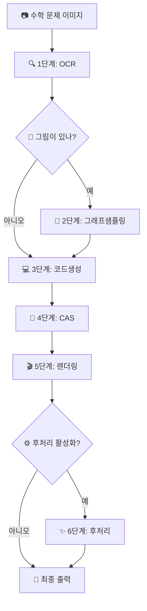

# Manion - AI 기반 수학 애니메이션 파이프라인

> AI를 활용하여 수학 문제를 아름다운 Manim 애니메이션으로 변환

[](https://python.org)
[](https://manim.community)
[](LICENSE)

## 🌟 개요

**Manion**은 수학 문제 이미지를 고품질 Manim 애니메이션 코드와 비디오로 변환하는 지능형 파이프라인입니다. OCR, 그래프 샘플링, 코드 생성, 기호 연산, 후처리를 결합하여 교육용 애니메이션을 자동으로 생성합니다.

### ✨ 주요 특징

- **🧠 AI 기반**: 정확한 수학적 내용 이해를 위한 고급 OCR 및 LLM 모델 사용
- **🎨 아름다운 애니메이션**: 전문가 수준의 Manim 애니메이션 생성
- **🔧 모듈화 설계**: 각 단계를 독립적으로 실행하거나 전체 파이프라인의 일부로 실행 가능
- **⚡ 유연성**: 이미지만 입력 또는 구조화된 입력 모드 지원
- **🛡️ 견고함**: 포괄적인 오류 처리 및 안전한 폴백
- **🎯 스마트**: 다양한 수학적 콘텐츠 유형을 자동으로 감지 및 처리

## 🚀 빠른 시작

### 필수 요구사항

- Python 3.8 이상
- CUDA 호환 GPU (OCR 모델 권장)

### 설치

1. **저장소 클론**
```bash
git clone <repository-url>
cd manion-main
```

2. **의존성 설치**
```bash
pip install -r requirements.txt
```

3. **설정 구성**
```bash
# API 키와 모델 설정을 위해 configs/openai.toml 편집
cp configs/openai.toml.example configs/openai.toml
```

### 기본 사용법

**전체 파이프라인 실행:**
```bash
# 간단한 이미지 입력
python -m pipelines.cli_e2e path/to/math_problem.png

# 사용자 정의 문제 이름과 함께
python -m pipelines.cli_e2e path/to/math_problem.png --problem-name "problem1"

# 향상된 품질을 위한 후처리 활성화
python -m pipelines.cli_e2e path/to/math_problem.png --postproc
```

## 📊 파이프라인 아키텍처

Manion은 **6개의 지능형 단계**를 통해 수학 문제를 처리합니다:



### 단계별 상세 정보

| 단계 | 이름 | 목적 | 핵심 기술 |
|------|------|------|-----------|
| 1 | **OCR** | 텍스트 및 수학적 표현식 추출 | DotsOCR, 비전 모델 |
| 2 | **그래프샘플링** | 그래픽 요소 벡터화 | potrace, SVG 처리 |
| 3 | **코드생성** | Manim 애니메이션 코드 생성 | GPT, 구조화된 프롬프트 |
| 4 | **CAS** | 기호 연산 수행 | SymPy, 의존성 해결 |
| 5 | **렌더링** | 최종 Manim 코드 생성 | 플레이스홀더 치환 |
| 6 | **후처리** | 출력 개선 및 검증 | LLM 개선, Manim 렌더링 |

## 🛠️ 고급 사용법

### 개별 단계 실행

특정 파이프라인 단계를 독립적으로 실행:

```bash
# 1단계: OCR 처리
python -m pipelines.cli_stage a_ocr --problem-name test --image problem.jpg

# 2단계: 그래프 샘플링 (vector.json 생성)
python -m pipelines.cli_stage b_graphsampling --problem-name test

# 3단계: LLM 기반 spec 작성
python -m pipelines.cli_stage c_geo_codegen --problem-name test --force

# 4단계: 결정적 기하 계산
python -m pipelines.cli_stage d_geo_compute --problem-name test

# 5단계: Manim + CAS 코드 생성
python -m pipelines.cli_stage e_cas_codegen --problem-name test --force

# 6단계: CAS 실행
python -m pipelines.cli_stage f_cas_compute --problem-name test

# 7단계: 플레이스홀더 치환
python -m pipelines.cli_stage g_render --problem-name test

# 8단계: 후처리 (선택)
python -m pipelines.cli_stage h_postproc --problem-name test
```

### 후처리 제어

후처리 단계를 세밀하게 조정:

```bash
# 후처리 강제 활성화
python -m pipelines.cli_e2e image.png --postproc

# 후처리 강제 비활성화
python -m pipelines.cli_e2e image.png --no-postproc

# 설정에서 활성화된 경우 후처리가 자동으로 실행됨
```

## ⚙️ 설정

### 메인 설정 (`configs/openai.toml`)

```toml
[models]
codegen = "gpt-4"  # 코드 생성 모델
postproc = "Qwen/Qwen2.5-Coder-14B-Instruct-AWQ"  # 후처리 모델

[gen]
temperature = 1.0
max_tokens = 4096

[postproc]
enabled = true                    # 후처리 활성화/비활성화
base_url = "http://127.0.0.1:8000/v1"  # LLM API 엔드포인트
api_key = "your-api-key"          # 인증 키
max_loops = 3                     # 최대 개선 반복 횟수
temperature = 0.2                 # 후처리용 LLM 온도
quality = "-ql"                   # Manim 렌더링 품질
timeout_sec = 40                  # 처리 타임아웃
```

### 환경 변수

설정을 재정의:

```bash
# 후처리 활성화
export POSTPROC_ENABLED_OVERRIDE=1

# 후처리 비활성화
export POSTPROC_ENABLED_OVERRIDE=0
```

## 📁 프로젝트 구조

```
manion-main/
├── 📂 apps/                    # 핵심 애플리케이션 모듈
│   ├── a_ocr/                 # OCR 처리 (DotsOCR)
│   ├── b_graphsampling/       # 벡터 그래픽 처리
│   ├── c_geo_codegen/         # LLM 기반 spec 작성
│   ├── d_geo_compute/         # 결정적 기하 계산기
│   ├── e_cas_codegen/         # Manim+CAS 코드 생성
│   ├── f_cas_compute/         # SymPy CAS 실행 도우미
│   ├── g_render/              # 플레이스홀더 치환
│   └── h_postproc/            # 선택적 후처리 스크립트
├── 📂 libs/                   # 공유 라이브러리
│   ├── postproc/             # 🆕 후처리 모듈
│   ├── schemas.py            # 데이터 모델
│   └── geo/                  # 기하학적 유틸리티
├── 📂 pipelines/             # 파이프라인 오케스트레이션
│   ├── stages.py             # 개별 단계 함수들
│   ├── e2e.py               # 종단간 파이프라인
│   ├── cli_e2e.py           # E2E 명령줄 인터페이스
│   └── cli_stage.py         # 단계별 CLI
├── 📂 configs/               # 설정 파일
│   ├── openai.toml          # 메인 설정
│   ├── render.toml          # 렌더링 설정
│   └── sympy.toml           # CAS 설정
└── 📄 requirements.txt       # Python 의존성
```

## 🔧 출력 구조

파이프라인은 체계적으로 구성된 출력을 생성합니다:

```
Probleminput/
└── problem_name/
    ├── problem.json              # OCR 결과
    ├── problem.jpg               # 원본 이미지 복사본
    ├── vector.json               # 도형 벡터화 결과 (B 단계)
    ├── spec.json                 # 기하 스펙 (C/D 단계)
    ├── manim_draft.py            # LLM 초안 코드 (E 단계)
    ├── cas_jobs.json             # CAS 작업 목록
    ├── cas_results.json          # SymPy 계산 결과
    └── problem_final.py          # 플레이스홀더가 채워진 스크립트

ManimcodeOutput/
└── problem_name/
    └── problem_name.py           # 렌더링 가능한 Manim 코드
```

> ℹ️ 선택적 후처리 단계(`h_postproc`)가 실행되면 동일한 디렉터리에
> `final_manimcode.py`, 렌더링된 영상, 증명 로그 등의 추가 산출물이 생성될 수 있습니다.

## 🛡️ 안전성 및 신뢰성

### 내장 안전 기능

- **🔄 우아한 폴백**: 선택적 단계가 실패해도 파이프라인이 계속 진행
- **✅ 입력 검증**: 누락되거나 잘못된 입력의 자동 감지
- **🔒 비침습적**: 후처리를 안전하게 비활성화해도 핵심 기능에 영향 없음
- **📊 포괄적 로깅**: 상세한 진행 상황 및 오류 보고
- **⚡ 타임아웃 보호**: 장시간 실행 작업에서의 무한 대기 방지

### 오류 처리

```bash
# 상세한 오류 보고
python -m pipelines.cli_e2e image.png --verbose

# 개별 단계 디버깅
python -m pipelines.cli_stage 1 --image-path image.png --verbose
```

## 🎯 사용 사례

### 교육 콘텐츠 제작
- 수학적 개념의 애니메이션 설명 생성
- 대화형 문제 해결 시연 제작
- 고품질 교육용 비디오 제작

### 연구 및 개발
- 수학적 시각화 프로토타입 제작
- 수학적 알고리즘 테스트 및 검증
- 재현 가능한 계산 예제 생성

### 콘텐츠 자동화
- 수학 문제 세트의 배치 처리
- 애니메이션 제작 워크플로우 자동화
- 교육 플랫폼과의 통합

## 🤝 기여하기

기여를 환영합니다! 자세한 내용은 [기여 가이드라인](CONTRIBUTING.md)을 참조하세요.

### 개발 환경 설정

```bash
# 개발 의존성 설치
pip install -r requirements-dev.txt

# 테스트 실행
python -m pytest tests/

# 코드 포맷팅
black .
isort .
```

## 📜 라이선스

이 프로젝트는 MIT 라이선스 하에 있습니다. 자세한 내용은 [LICENSE](LICENSE) 파일을 참조하세요.

## 🙏 감사의 말

- **Manim Community** - 놀라운 애니메이션 프레임워크 제공
- **OpenAI** - GPT 모델 제공
- **DotsOCR** - 수학적 OCR 기능 제공
- **SymPy** - 기호 수학 기능 제공
- **모든 기여자들** - 이 프로젝트를 더 좋게 만드는 데 도움을 주신 분들

## 📞 지원

- **이슈**: [GitHub Issues](https://github.com/your-repo/issues)
- **토론**: [GitHub Discussions](https://github.com/your-repo/discussions)
- **문서**: [Wiki](https://github.com/your-repo/wiki)

---

**수학 교육 커뮤니티를 위해 ❤️로 만들어진 프로젝트**
